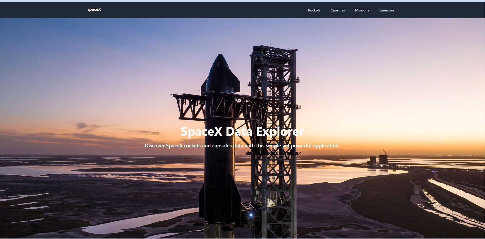
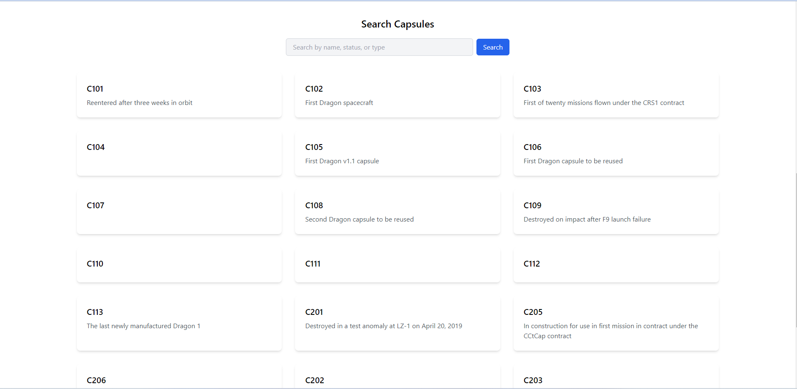
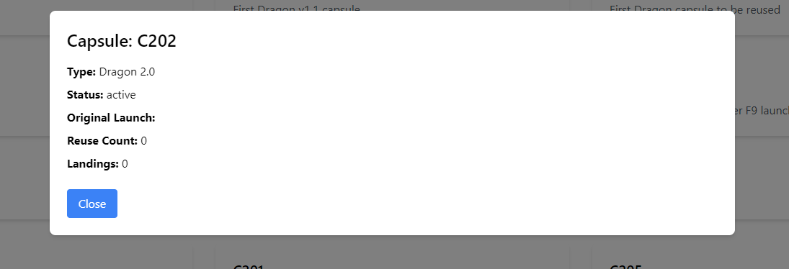

# Frontend Assignment - Dinesh Katariya

This project is a assignment for job interview.





## Vite 

used to create this assignment project. it's a faster tool suggested by react.dev react docs to build row reactjs project.

## Tailwind CSS Blocks

Tailwind CSS Blocks are pre-built UI components that help in accelerating the development process. These blocks provide the necessary styling and structure to create responsive and visually appealing designs. By leveraging these blocks, I was able to create a responsive and modern-looking UI quickly.

### How to add a Tailwind CSS Block

1. Find the desired block on the [Tailwind CSS Blocks](https://tailwind.build/) website or any other source.
2. Copy the block's HTML code.
3. Paste the code into your React component.
4. Modify the code as necessary to suit your project's requirements.

## logic for pagination
found it out half through internet and half through chatGPT
## Adding a Screenshot to the Markdown File

To add a screenshot to the markdown file, follow these steps:

1. Take a screenshot of your project and save it as `screenshot.png` (or any other preferred format and name).
2. Add the screenshot to your repository, preferably in the root directory or a dedicated folder like `assets` or `images`.
3. In the markdown file, use the following syntax to display the image:

```markdown

